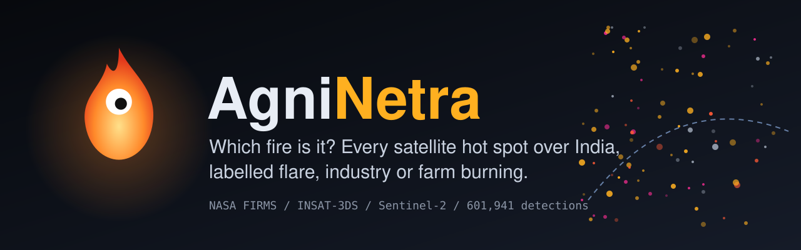
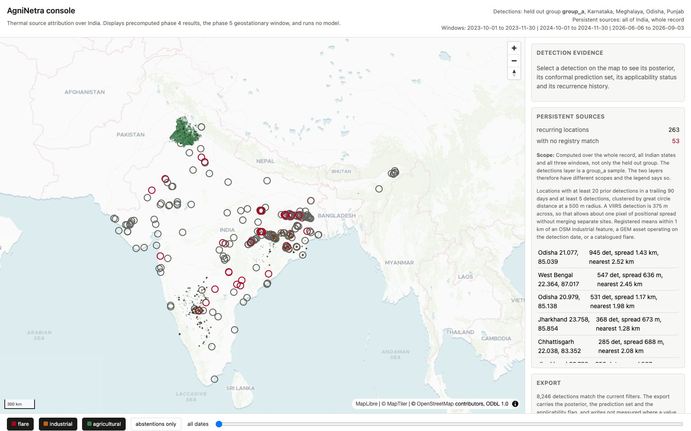
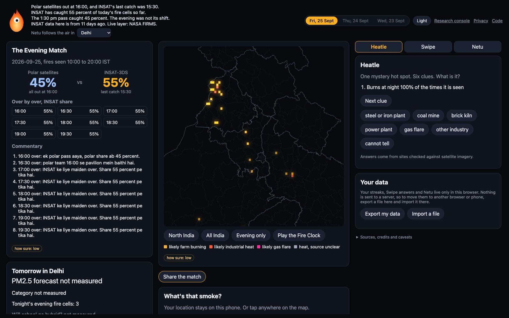
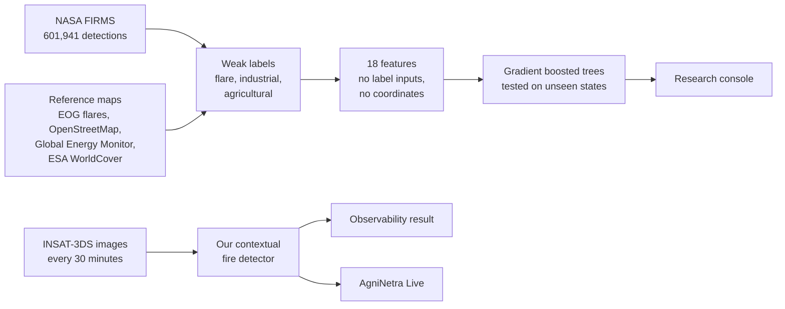

  

  <a href="https://agninetra.chinmayathakral.com"><b>AgniNetra Live</b></a>
  &nbsp;&middot;&nbsp;
  <a href="https://agninetra-console.chinmayathakral.com"><b>Research console</b></a>
  &nbsp;&middot;&nbsp;
  <a href="#the-dataset-bharatthermal-1"><b>Dataset</b></a>
  &nbsp;&middot;&nbsp;
  <a href="#what-we-found"><b>Findings</b></a>

  
  
  
  
  
  

NASA's fire satellites tell you **where** something hot is. They cannot tell you **what**
is burning: a refinery gas flare, a steel plant, a cement kiln and a farmer burning
stubble all arrive as the same row in the feed. AgniNetra labels every one of those hot
spots over India as **flare**, **industrial** or **agricultural**, measures how far that
can be trusted, and shows it in two apps: a research console for the evidence, and a
public app that turns India's evening crop burning into a cricket match between
satellites.

Built by Chinmaya Thakral.

## Two apps, two branches

| Branch | What it is | Live at | Built with | Deploys with |
|---|---|---|---|---|
| [`console`](https://github.com/ChinmayaThakral/AgniNetra/tree/console) (default) | The research: data pipeline, labels, models, evaluation, the dataset export, and the console that shows the results | [agninetra-console.chinmayathakral.com](https://agninetra-console.chinmayathakral.com) | Python, DuckDB, scikit-learn, Next.js, MapLibre | Nixpacks, `nixpacks.toml` |
| [`agninetra`](https://github.com/ChinmayaThakral/AgniNetra/tree/agninetra) | Everything on `console`, plus **AgniNetra Live** in `apps/live/`: the evening fire match, Heatle, Swipe and Netu | [agninetra.chinmayathakral.com](https://agninetra.chinmayathakral.com) | TypeScript, Vite, a Python feed server | Docker, `Dockerfile` |

Changes flow one way: `console` is merged into `agninetra`, never the reverse. The
research branch therefore stays exactly what the research report describes, while the
public app is free to grow on top of it.

## The research console

Every detection on the map carries its class probabilities, a conformal prediction set,
whether it lies inside the model's applicability domain, and its recurrence history.
Persistent sources, places that burn again and again, are ringed, with their distance to
the nearest registered asset. The console runs no model: everything it shows is
precomputed, so a number on screen and a number in the report have one source.

## AgniNetra Live

**Netu**, a one-eyed flame, hosts a match every evening. NASA's polar satellites pass at
fixed times and are "all out" by mid afternoon; India's own geostationary INSAT-3DS keeps
batting through the evening, when most stubble is burned. A team scores by the **share**
of fires it catches, never by how many fires there are.

- **The Evening Match**, refreshed every thirty minutes from 16:37 IST: scores, over by over shares, Hinglish commentary and a Fire Clock that fills the map.
- **Heatle**, one verified mystery site a day, six clues including Sentinel-2 pictures.
- **Swipe**, 258 satellite pictures of recurring night time hot spots to label; eight verified sites are hidden gold questions.
- **Tomorrow card** with the next day's PM2.5 forecast for 22 cities, **"What's that smoke?"** upwind lookup, share images, **Smog Wrapped** in December, light and dark themes.
- **Netu as a pet** that levels up as you play and follows your city's air.

Its rules are built in: farm fires only ever appear per district or 11 km cell, never per
field; points come from seeing fires, never from burning; industry is "likely industrial
heat", never "polluter"; and there are no accounts. A player's history stays in their own
browser, can be exported to a file and imported elsewhere, and is never sent to a server.

## What we found

- **Farm fire against industry: separable.** Gradient boosted trees reach a macro F1 of
  **0.635** across three held out state groups, with a spread of 0.050.
- **Flare against industry: not separable from polar data.** 80.2 to 88.4 percent of
  flares are predicted industrial, because both burn mostly at night.
- **Why: the polar satellites look at six fixed times of day.** 98.91 percent of all
  detections fall within an hour of one of them, leaving a **7.40 hour** gap every
  afternoon and evening.
- **INSAT-3DS sees that gap.** On 1 to 3 November 2024 the polar record shows no farm
  fires at all between 15:00 and 17:59 IST; the geostationary record puts **48.8 percent**
  of the day's burning there, peaking at 16:00.
- **Honest evaluation matters.** On the same rows, a random train and test split
  overstates macro F1 by 0.115 and makes calibrated uncertainty look correct when, under
  spatial blocking, it is not.

The evening shift itself was published first by ISRO, Jethva (2026) and iFOREST (2025);
what is new here is using time of day to **assign** a source class, using INSAT-3DS, the
benchmark, and the spatially blocked protocol with its measured optimism. The limits are
stated as carefully as the results: weak labels are not ground truth, and the INSAT-3DS
detector has no independent validation yet.

## The dataset: BharatThermal-1

601,941 NASA FIRMS detections over India across the October to November burning seasons
of 2023 and 2024 and the 2026 monsoon. 469,430 fall inside an Indian state and carry a
weak label: 296,091 agricultural, 91,276 industrial, 4,553 flare and 77,510 unlabelled.
Each row has the thermal properties FIRMS publishes, recurrence features, distances to
the reference maps, and a `split_group` column for spatially blocked evaluation.

    uv run python scripts/export_kaggle.py

writes Parquet, gzipped CSV, a column dictionary, a README and Kaggle metadata to
`data/kaggle/bharatthermal-1/`. The dataset is ODbL 1.0. Distances to catalogued gas
flares are published only as bands, so the flare catalogue cannot be reconstructed.

## Run it yourself

Python 3.11 with [uv](https://docs.astral.sh/uv/), and Node 22.

    uv sync --extra dev
    uv run pytest

    cd apps/console && npm ci && npm run dev

AgniNetra Live, on the `agninetra` branch:

    cd apps/live/web && npm ci && npm run build && cd ../../..
    uv run python -m apps.live.serve --no-build

The live feed needs a NASA FIRMS map key and a MOSDAC account in `.env`; copy
`.env.example`. Without them, ingestion reports itself as blocked rather than inventing
data. `requirements.lock.txt` freezes the exact environment the published results came
from.

## Repository layout

    ml/              Python package: ingestion, reference layers, features, labels, models, evaluation
    scripts/         backfills, exports and the commands that regenerate every reported number
    tests/           pytest suite, over 400 tests
    apps/console/    Next.js research console
    apps/live/       AgniNetra Live, on the agninetra branch: pipeline/, web/, serve.py

## Attribution

- **NASA FIRMS.** We acknowledge the use of data from NASA LANCE FIRMS, part of NASA's Earth Science Data and Information System. <https://firms.modaps.eosdis.nasa.gov/>
- **MOSDAC, SAC, ISRO.** INSAT-3DS imagery. Detections shown are this project's own value added product. <https://mosdac.gov.in>
- **OpenStreetMap.** Copyright OpenStreetMap contributors, ODbL 1.0. <https://www.openstreetmap.org/copyright>
- **Global Energy Monitor.** Plant and mine trackers, CC BY 4.0. <https://globalenergymonitor.org/>
- **ESA WorldCover.** 10 m 2021 v200, CC BY 4.0. <https://esa-worldcover.org/>
- **Copernicus.** Contains modified Copernicus Sentinel data; air quality forecasts from the Copernicus Atmosphere Monitoring Service via Open-Meteo.
- **EOG, Colorado School of Mines.** VIIRS global gas flaring catalogue, used only as distance bands. <https://eogdata.mines.edu/>
- **MapTiler.** Basemap tiles in the console.

## Licence

Code is MIT, written results are CC BY 4.0, and the BharatThermal-1 dataset is ODbL 1.0.
See [`LICENSE`](LICENSE). If you use the dataset or the findings, please cite this
repository; GitHub's "Cite this repository" button gives the reference.
